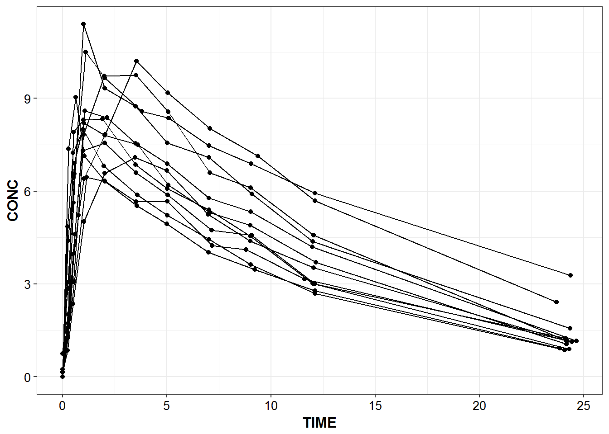
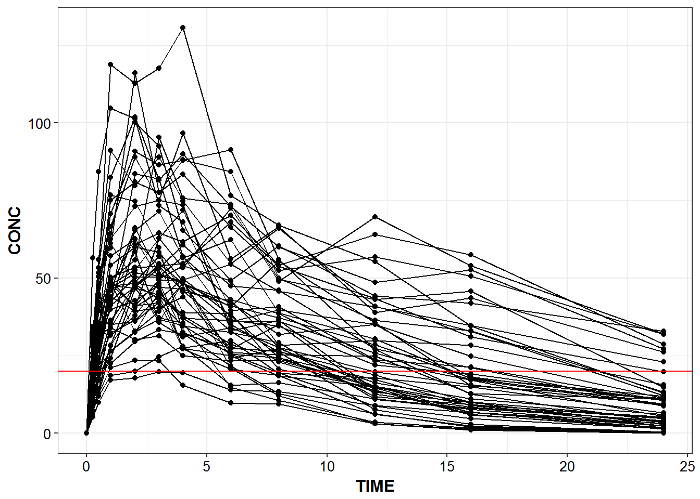
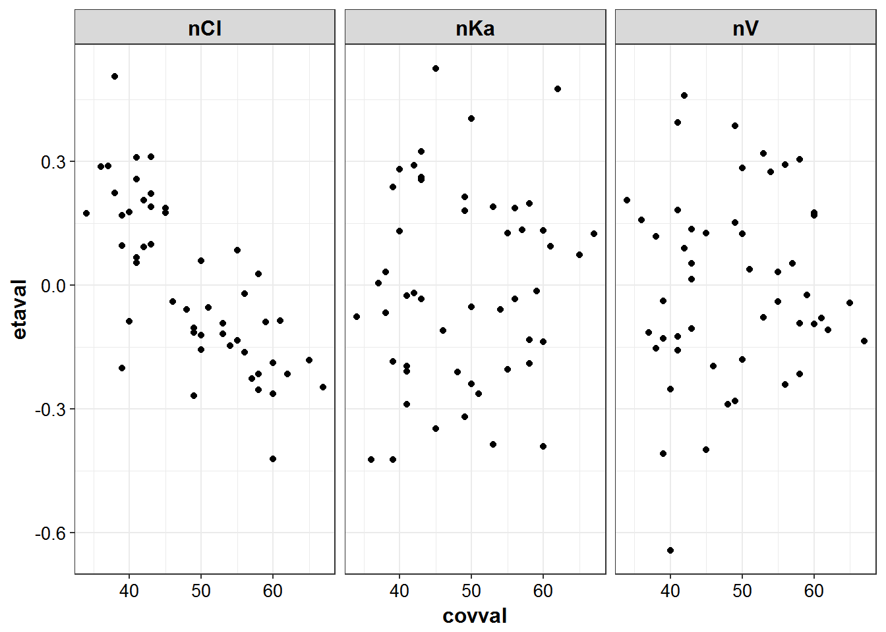
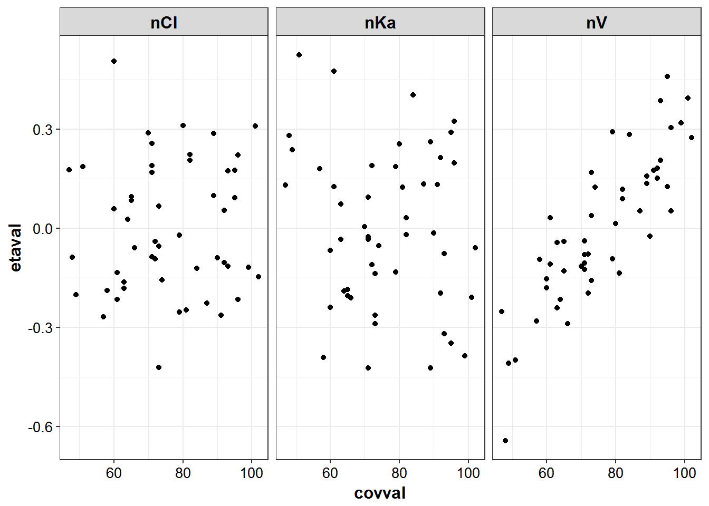
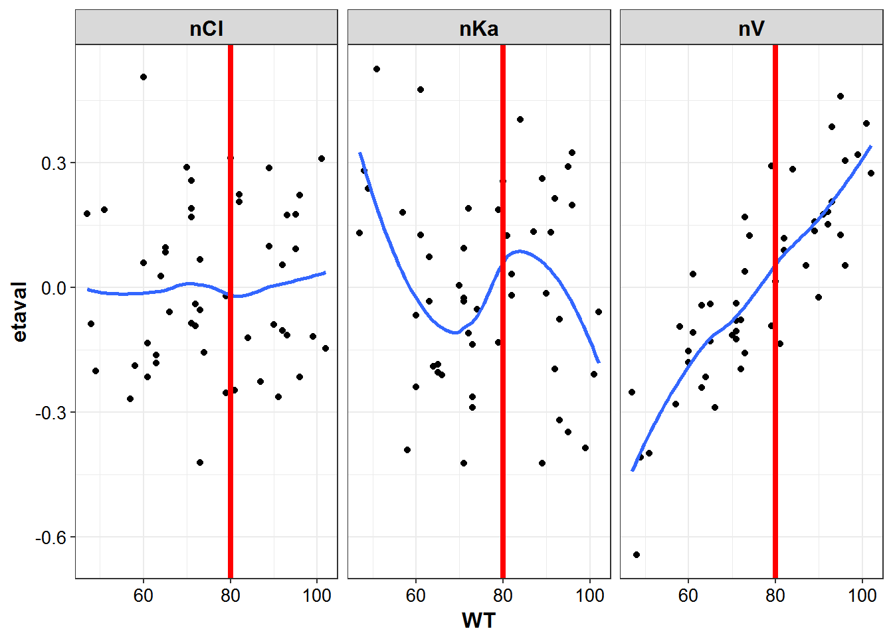
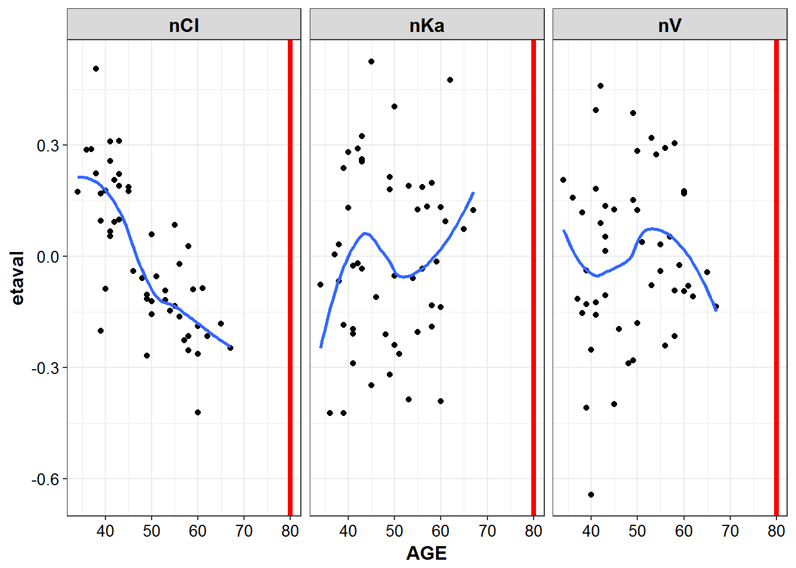

# Nonstandard evaluation


```r
library(lazyeval)
library(PKPDdatasets)
library(PKPDmisc)
library(tidyverse)
#> Loading tidyverse: ggplot2
#> Loading tidyverse: tibble
#> Loading tidyverse: tidyr
#> Loading tidyverse: readr
#> Loading tidyverse: purrr
#> Loading tidyverse: dplyr
#> Conflicts with tidy packages ----------------------------------------------
#> filter():     dplyr, stats
#> is_formula(): purrr, lazyeval
#> lag():        dplyr, stats
```


```r
eta_cov <- read_csv("../data/EtaCov_base.csv")
#> Parsed with column specification:
#> cols(
#>   Scenario = col_character(),
#>   ID = col_integer(),
#>   WT = col_integer(),
#>   AGE = col_integer(),
#>   nV = col_double(),
#>   nCl = col_double(),
#>   nKa = col_double()
#> )
```

* lazyeval::interp()
* lazyeval::lazy_eval()

This doesn't work, as inside aes, ggplot literally evaluates the column names,
so will look for the column called xtemplate, instead of Time


```r
x <- "Time"
y <- "Conc"
ggplot(df, 
       aes(x=xtemplate, 
           y=ytemplate, 
           group = group_template)) + 
  geom_line() + 
  geom_point()
```


```r
conc_time <- function(df, xcol, ycol, group_var) {
  p <- lazyeval::interp(~ggplot(df, 
       aes(x=xtemplate, 
           y=ytemplate, 
           group = group_template)) + 
  geom_line() + 
  geom_point() + theme_bw() + base_theme(),
                        xtemplate = as.name(xcol),
                        ytemplate = as.name(ycol),
                        group_template = as.name(group_var))
    
  return(lazyeval::lazy_eval(p))
}
```


```r
capitalize_names(Theoph) %>%
  conc_time("TIME", "CONC", "SUBJECT")
```



```r


capitalize_names(sd_oral_richpk) %>%
  conc_time("TIME", "CONC", "ID") +
  geom_hline(yintercept = 20, color = "red")
```




```r
eta_vs_cov <- function(df, xcol, ycol, group_var, facet_var) {
  p <- lazyeval::interp(~ggplot(df, 
       aes(x=xtemplate, 
           y=ytemplate, 
           group = group_template))  + 
  geom_point() + facet_wrap(~facet_template) + stat_smooth(se = F) +
    theme_bw() + base_theme(),
                        xtemplate = as.name(xcol),
                        ytemplate = as.name(ycol),
                        group_template = as.name(group_var),
                        facet_template = as.name(facet_var))
    
  return(lazyeval::lazy_eval(p))
}
```


```r
g_eta_cov <- eta_cov %>% gather(etaname, etaval, nV:nKa)
```


```r
g2_eta_cov <- g_eta_cov %>% gather(covname, covval, AGE, WT)

eta_cov_list <- g2_eta_cov %>% split(.$covname)
```


```r
eta_cov_list %>% lapply(eta_vs_cov, "covval", "etaval", group = "etaval", "etaname")
#> $AGE
#> `geom_smooth()` using method = 'loess'
```



```
#> 
#> $WT
#> `geom_smooth()` using method = 'loess'
```




```r
cov_df <- eta_cov %>% select(WT:AGE)
plot_list <- list()
for (name in names(cov_df)) {
   plot_list[[name]] <- g_eta_cov %>% 
    eta_vs_cov(name, 
               "etaval", 
               group = "etaname", 
               facet_var = "etaname")
}


plot_list[["WT"]] + geom_vline(xintercept = 80, color = "red", size = 1.5)
#> `geom_smooth()` using method = 'loess'
```


```r

lapply(plot_list, function(x) {
    # be aware that hard coded intercepts can run into issues with multiple plots
    #instead should use a list or named vector to setup the xintercept by cov name
  p <- x + geom_vline(xintercept = 80, color = "red", size = 1.5)
  return(p)
})
#> $WT
#> `geom_smooth()` using method = 'loess'
```



```
#> 
#> $AGE
#> `geom_smooth()` using method = 'loess'
```




