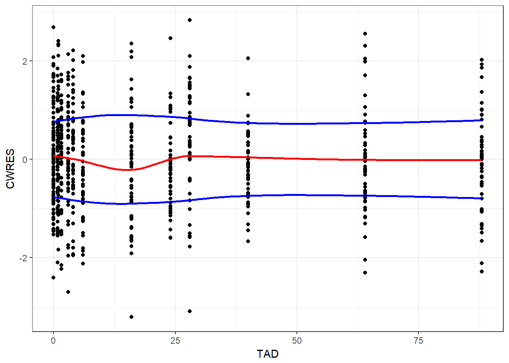
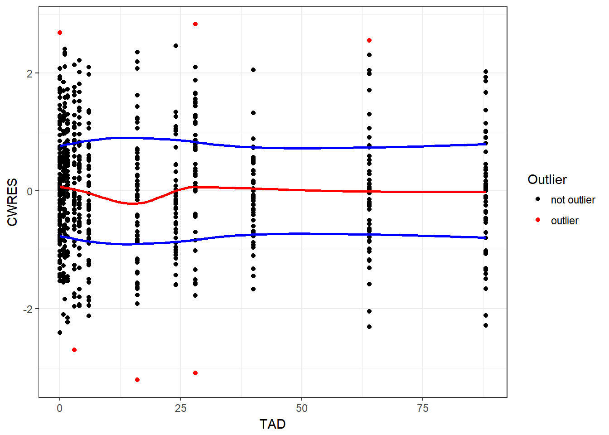

# Diagnostic Plots

1) read in the csv datasets:

* Residuals


```r
library(PKPDmisc)
library(knitr)
library(tidyverse)
#> Loading tidyverse: ggplot2
#> Loading tidyverse: tibble
#> Loading tidyverse: tidyr
#> Loading tidyverse: readr
#> Loading tidyverse: purrr
#> Loading tidyverse: dplyr
#> Conflicts with tidy packages ----------------------------------------------
#> filter(): dplyr, stats
#> lag():    dplyr, stats
```


```r
resid <- read_csv("../data/Residuals.csv")
#> Parsed with column specification:
#> cols(
#>   Scenario = col_character(),
#>   ID = col_integer(),
#>   IVAR = col_double(),
#>   TAD = col_double(),
#>   PRED = col_double(),
#>   IPRED = col_double(),
#>   DV = col_double(),
#>   IRES = col_double(),
#>   Weight = col_double(),
#>   IWRES = col_double(),
#>   WRES = col_double(),
#>   CWRES = col_double(),
#>   CdfDV = col_integer(),
#>   TADSeq = col_integer(),
#>   ObsName = col_character(),
#>   ResetSeq = col_integer()
#> )
```

* Create a Res vs Time function with loess fits for the central tendency and the spread (hint abs() is your friend for the spread). 
    * Conditionally allow the loess curve of central tendency to appear, 
    with a default of TRUE. 
    * Users should be able to specify the residual column name.


```r
gg_res_tad <- function(df, .tad, .res, .show_loess = TRUE) {
    .tad <- rlang::enexpr(.tad)
    .res <- rlang::enexpr(.res)
    ple <- rlang::quo(
        df %>%
          ggplot(aes(x = !!.tad, y = !!.res)) + geom_point() +
          stat_smooth(data = df %>%
                        mutate(!!.res := abs(!!.res)), 
                      se = F, color = "blue") +
          stat_smooth(data = df %>%
                        mutate(!!.res := -abs(!!.res)), 
                      se = F, color = "blue") +
            theme_bw()
    )
    output <- rlang::eval_tidy(ple) 
    if (.show_loess) {
       return(
           output + 
            stat_smooth(method = "loess", se=F, color = "red")
       ) 
    }
    return(output)
}
```


### CWRES vs time after dose (TAD)


```r
gg_res_tad(resid, TAD, CWRES)
#> `geom_smooth()` using method = 'loess'
#> `geom_smooth()` using method = 'loess'
```



* update your function to flag any point over some threshold as red, with a default of absolute difference of > 2.5 


```r
gg_res_tad <- function(df, .tad, .res, .threshold = 2.5, .show_loess = TRUE) {
    .tad <- rlang::enexpr(.tad)
    .res <- rlang::enexpr(.res)
    ple <- rlang::quo(
     df %>% 
        mutate(HIGHRES__ = ifelse(abs(!!.res) > .threshold, 1, 0)) %>%
          ggplot(aes(x = !!.tad, y = !!.res)) +
          geom_point(aes(color = factor(HIGHRES__))) +
          scale_color_manual(values = c("black", "red"), 
                             name = "Outlier", 
                             labels = c("not outlier", "outlier")) +
          stat_smooth(data = df %>%
                        mutate(!!.res := abs(!!.res)), 
                      se = F, color = "blue") +
          stat_smooth(data = df %>%
                        mutate(!!.res := -abs(!!.res)), 
                      se = F, color = "blue") +
            theme_bw()
    )
    output <- rlang::eval_tidy(ple) 
    if (.show_loess) {
       return(
           output + 
            stat_smooth(method = "loess", se=F, color = "red")
       ) 
    }
    return(output)
}
```


```r
gg_res_tad(resid, TAD, CWRES)
#> `geom_smooth()` using method = 'loess'
#> `geom_smooth()` using method = 'loess'
```




```r
devtools::session_info()
#> Session info -------------------------------------------------------------
#>  setting  value                       
#>  version  R version 3.4.0 (2017-04-21)
#>  system   x86_64, mingw32             
#>  ui       RTerm                       
#>  language (EN)                        
#>  collate  English_United States.1252  
#>  tz       Europe/Prague               
#>  date     2017-06-05
#> Packages -----------------------------------------------------------------
#>  package    * version  date       source                            
#>  assertthat   0.2.0    2017-04-11 CRAN (R 3.4.0)                    
#>  backports    1.1.0    2017-05-22 CRAN (R 3.4.0)                    
#>  base       * 3.4.0    2017-04-21 local                             
#>  bindr        0.1      2016-11-13 CRAN (R 3.4.0)                    
#>  bindrcpp   * 0.1      2016-12-11 CRAN (R 3.4.0)                    
#>  bookdown     0.4      2017-05-20 CRAN (R 3.4.0)                    
#>  broom        0.4.2    2017-02-13 CRAN (R 3.4.0)                    
#>  cellranger   1.1.0    2016-07-27 CRAN (R 3.4.0)                    
#>  codetools    0.2-15   2016-10-05 CRAN (R 3.4.0)                    
#>  colorspace   1.3-2    2016-12-14 CRAN (R 3.4.0)                    
#>  compiler     3.4.0    2017-04-21 local                             
#>  datasets   * 3.4.0    2017-04-21 local                             
#>  devtools     1.13.1   2017-05-13 CRAN (R 3.4.0)                    
#>  digest       0.6.12   2017-01-27 CRAN (R 3.4.0)                    
#>  dplyr      * 0.6.0    2017-06-02 Github (tidyverse/dplyr@b064c4b)  
#>  evaluate     0.10     2016-10-11 CRAN (R 3.4.0)                    
#>  forcats      0.2.0    2017-01-23 CRAN (R 3.4.0)                    
#>  foreign      0.8-67   2016-09-13 CRAN (R 3.4.0)                    
#>  ggplot2    * 2.2.1    2016-12-30 CRAN (R 3.4.0)                    
#>  glue         1.0.0    2017-04-17 CRAN (R 3.4.0)                    
#>  graphics   * 3.4.0    2017-04-21 local                             
#>  grDevices  * 3.4.0    2017-04-21 local                             
#>  grid         3.4.0    2017-04-21 local                             
#>  gtable       0.2.0    2016-02-26 CRAN (R 3.4.0)                    
#>  haven        1.0.0    2016-09-23 CRAN (R 3.4.0)                    
#>  hms          0.3      2016-11-22 CRAN (R 3.4.0)                    
#>  htmltools    0.3.6    2017-04-28 CRAN (R 3.4.0)                    
#>  httr         1.2.1    2016-07-03 CRAN (R 3.4.0)                    
#>  jsonlite     1.5      2017-06-01 CRAN (R 3.4.0)                    
#>  knitr      * 1.16     2017-05-18 CRAN (R 3.4.0)                    
#>  labeling     0.3      2014-08-23 CRAN (R 3.4.0)                    
#>  lattice      0.20-35  2017-03-25 CRAN (R 3.4.0)                    
#>  lazyeval     0.2.0    2016-06-12 CRAN (R 3.4.0)                    
#>  lubridate    1.6.0    2016-09-13 CRAN (R 3.4.0)                    
#>  magrittr     1.5      2014-11-22 CRAN (R 3.4.0)                    
#>  memoise      1.1.0    2017-04-21 CRAN (R 3.4.0)                    
#>  methods      3.4.0    2017-04-21 local                             
#>  mnormt       1.5-5    2016-10-15 CRAN (R 3.4.0)                    
#>  modelr       0.1.0    2016-08-31 CRAN (R 3.4.0)                    
#>  munsell      0.4.3    2016-02-13 CRAN (R 3.4.0)                    
#>  nlme         3.1-131  2017-02-06 CRAN (R 3.4.0)                    
#>  parallel     3.4.0    2017-04-21 local                             
#>  PKPDmisc   * 1.0.0    2017-06-02 Github (dpastoor/PKPDmisc@23e1f49)
#>  plyr         1.8.4    2016-06-08 CRAN (R 3.4.0)                    
#>  psych        1.7.5    2017-05-03 CRAN (R 3.4.0)                    
#>  purrr      * 0.2.2.2  2017-05-11 CRAN (R 3.4.0)                    
#>  R6           2.2.1    2017-05-10 CRAN (R 3.4.0)                    
#>  Rcpp         0.12.11  2017-05-22 CRAN (R 3.4.0)                    
#>  readr      * 1.1.1    2017-05-16 CRAN (R 3.4.0)                    
#>  readxl       1.0.0    2017-04-18 CRAN (R 3.4.0)                    
#>  reshape2     1.4.2    2016-10-22 CRAN (R 3.4.0)                    
#>  rlang        0.1.1    2017-05-18 CRAN (R 3.4.0)                    
#>  rmarkdown    1.5.9000 2017-06-03 Github (rstudio/rmarkdown@ea515ef)
#>  rprojroot    1.2      2017-01-16 CRAN (R 3.4.0)                    
#>  rvest        0.3.2    2016-06-17 CRAN (R 3.4.0)                    
#>  scales       0.4.1    2016-11-09 CRAN (R 3.4.0)                    
#>  stats      * 3.4.0    2017-04-21 local                             
#>  stringi      1.1.5    2017-04-07 CRAN (R 3.4.0)                    
#>  stringr      1.2.0    2017-02-18 CRAN (R 3.4.0)                    
#>  tibble     * 1.3.3    2017-05-28 CRAN (R 3.4.0)                    
#>  tidyr      * 0.6.3    2017-05-15 CRAN (R 3.4.0)                    
#>  tidyverse  * 1.1.1    2017-01-27 CRAN (R 3.4.0)                    
#>  tools        3.4.0    2017-04-21 local                             
#>  utils      * 3.4.0    2017-04-21 local                             
#>  withr        1.0.2    2016-06-20 CRAN (R 3.4.0)                    
#>  xml2         1.1.1    2017-01-24 CRAN (R 3.4.0)                    
#>  yaml         2.1.14   2016-11-12 CRAN (R 3.4.0)
```

