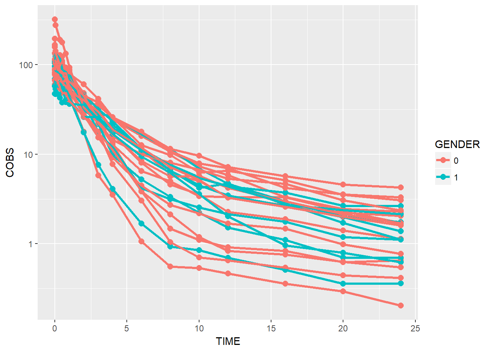
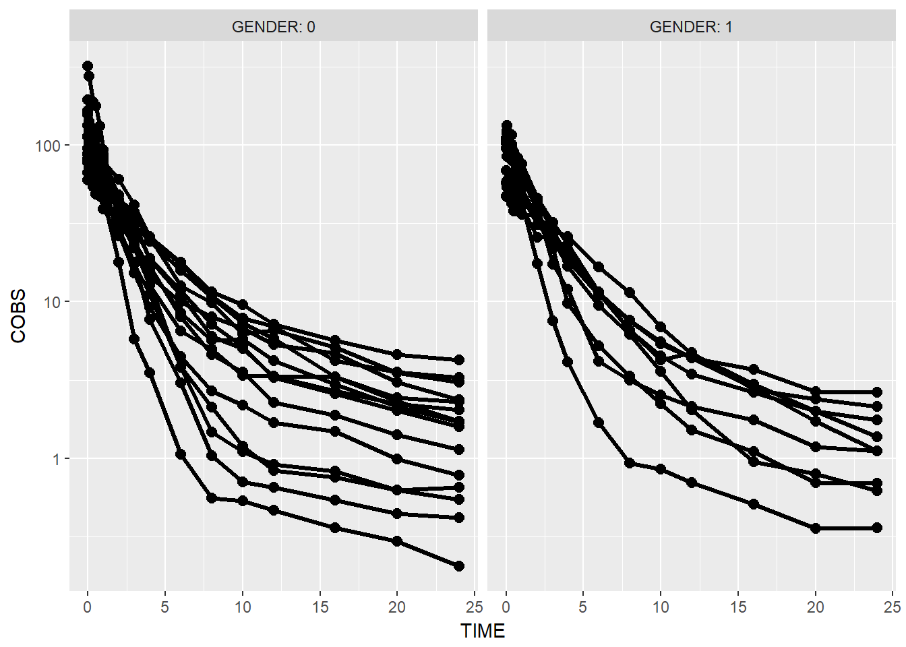
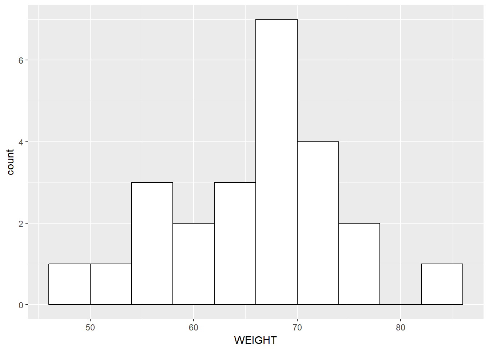

# Introduction to ggplot2


```r
library(PKPDmisc)
library(PKPDdatasets)
library(tidyverse)
#> Loading tidyverse: ggplot2
#> Loading tidyverse: tibble
#> Loading tidyverse: tidyr
#> Loading tidyverse: readr
#> Loading tidyverse: purrr
#> Loading tidyverse: dplyr
#> Conflicts with tidy packages ----------------------------------------------
#> filter(): dplyr, stats
#> lag():    dplyr, stats
```

## XY Plots
1) For concentration-time plots filter only OCC 1 from dapa_IV_oral (in PKPDdatasets) for subsequent plotting

```r
data1 <- dapa_IV_oral %>% filter(OCC == 1)
```

2) Basic Concentration-Time plot (point and lines)


```r
data1 %>% ggplot(aes(x = TIME, y = COBS, group = ID)) +
  geom_point() + geom_line()
```


3) make points/lines bigger


```r
data1 %>% ggplot(aes(x = TIME, y = COBS, group = ID)) +
  geom_point(size = 2.5) + geom_line(size = 1.1)
```


4) add log transformation to y axis


```r
data1 %>% ggplot(aes(x = TIME, y = COBS, group = ID)) +
  geom_point(size = 2.5) + geom_line(size = 1.1) +
  scale_y_log10()
```


5) Add color by gender


```r
data1 %>% 
    ggplot(aes(x = TIME, y = COBS, group = ID, color = GENDER)) +
    geom_point(size = 2.5) + geom_line(size = 1.1) +
    scale_y_log10()
```



BONUS: rename labels legend


```r
data1 %>% 
    ggplot(aes(x = TIME, y = COBS, group = ID, color = GENDER)) +
    geom_point(size = 2.5) + geom_line(size = 1.1) +
    scale_y_log10() + scale_color_discrete(labels = c("Male", "Female"))
```


BONUS: move legend to top right


```r
data1 %>% 
    ggplot(aes(x = TIME, y = COBS, group = ID, color = GENDER)) +
    geom_point(size = 2.5) + geom_line(size = 1.1) +
    scale_y_log10() + scale_color_discrete(labels = c("Male", "Female")) +
    theme(legend.position = c(1, 1), legend.justification = c(1, 1))
```


6) facet by race

Note, with facetting by race, the color becomes unnessary extra visual stimulus so we remove the color.


```r
data1 %>% 
    ggplot(aes(x = TIME, y = COBS, group = ID)) +
    geom_point(size = 2.5) + geom_line(size = 1.1) +
    scale_y_log10() +
    theme(legend.position = c(1, 1), legend.justification = c(1, 1)) +
    facet_wrap(~GENDER)
```


BONUS: rename facet strips by name

There are a couple ways of doing this:

1) on the fly mutate the the values to labels


```r
# this is the only time you will see assigning to a column directly
# in this workshop, we encourage to always use mutate to manage columns
# in a dataframe, however as it has not been formally introduced we're
# using base R here
data1$GENDER <-  factor(data1$GENDER, 
                         levels = c(0, 1), 
                         labels = c("Male", "Female")) 
data1 %>%
    ggplot(aes(x = TIME, y = COBS, group = ID)) +
    geom_point(size = 2.5) + geom_line(size = 1.1) +
    scale_y_log10() +
    theme(legend.position = c(1, 1), legend.justification = c(1, 1)) +
    facet_wrap(~GENDER)
```


Use facet_grid with the labeller argument


```r
data1 %>% 
   ggplot(aes(x = TIME, y = COBS, group = ID)) +
  geom_point(size = 2.5) + geom_line(size = 1.1) +
  scale_y_log10() +
    theme(legend.position = c(1, 1), legend.justification = c(1, 1)) +
  facet_grid(.~GENDER, labeller = label_both)
```



9) color by weight


```r
data1 %>% 
   ggplot(aes(x = TIME, y = COBS, group = ID, color = WEIGHT)) +
  geom_point(size = 2.5) + geom_line(size = 1.1) +
  scale_y_log10() +
    theme(legend.position = c(1, 1), legend.justification = c(1, 1))
```


BONUS: rename axes


```r
data1 %>% 
   ggplot(aes(x = TIME, y = COBS, group = ID, color = WEIGHT)) +
  geom_point(size = 2.5) + geom_line(size = 1.1) +
  scale_y_log10() +
    theme(legend.position = c(1, 1), 
          legend.justification = c(1, 1)) +
  labs(x = "Time, hours", y = "Concentration, ug/mL")
```


## Boxplots and Histograms

* Histogram(s) of demographics


```r
# distinct is a dplyr verb - easiest way to subset data by the 
# first row in some combination.
sid_data <- data1 %>% 
    distinct(ID, .keep_all = TRUE) # single row per id data

sid_data %>%
ggplot(aes(x = WEIGHT)) + 
  geom_histogram(binwidth= 4, color="black", fill="white")
```



* add vertical line for median value
  

```r
ggplot(data = sid_data, 
       aes(x = WEIGHT)) + 
  geom_histogram(binwidth= 4, color="black", fill="white") +
  geom_vline(aes(xintercept = median(WEIGHT)), size= 2, color = "red")
```


```r
devtools::session_info()
#> Session info -------------------------------------------------------------
#>  setting  value                       
#>  version  R version 3.4.0 (2017-04-21)
#>  system   x86_64, mingw32             
#>  ui       RTerm                       
#>  language (EN)                        
#>  collate  English_United States.1252  
#>  tz       Europe/Prague               
#>  date     2017-06-05
#> Packages -----------------------------------------------------------------
#>  package      * version  date       source                                
#>  assertthat     0.2.0    2017-04-11 CRAN (R 3.4.0)                        
#>  backports      1.1.0    2017-05-22 CRAN (R 3.4.0)                        
#>  base         * 3.4.0    2017-04-21 local                                 
#>  bindr          0.1      2016-11-13 CRAN (R 3.4.0)                        
#>  bindrcpp     * 0.1      2016-12-11 CRAN (R 3.4.0)                        
#>  bookdown       0.4      2017-05-20 CRAN (R 3.4.0)                        
#>  broom          0.4.2    2017-02-13 CRAN (R 3.4.0)                        
#>  cellranger     1.1.0    2016-07-27 CRAN (R 3.4.0)                        
#>  codetools      0.2-15   2016-10-05 CRAN (R 3.4.0)                        
#>  colorspace     1.3-2    2016-12-14 CRAN (R 3.4.0)                        
#>  compiler       3.4.0    2017-04-21 local                                 
#>  datasets     * 3.4.0    2017-04-21 local                                 
#>  devtools       1.13.1   2017-05-13 CRAN (R 3.4.0)                        
#>  digest         0.6.12   2017-01-27 CRAN (R 3.4.0)                        
#>  dplyr        * 0.6.0    2017-06-02 Github (tidyverse/dplyr@b064c4b)      
#>  evaluate       0.10     2016-10-11 CRAN (R 3.4.0)                        
#>  forcats        0.2.0    2017-01-23 CRAN (R 3.4.0)                        
#>  foreign        0.8-67   2016-09-13 CRAN (R 3.4.0)                        
#>  ggplot2      * 2.2.1    2016-12-30 CRAN (R 3.4.0)                        
#>  glue           1.0.0    2017-04-17 CRAN (R 3.4.0)                        
#>  graphics     * 3.4.0    2017-04-21 local                                 
#>  grDevices    * 3.4.0    2017-04-21 local                                 
#>  grid           3.4.0    2017-04-21 local                                 
#>  gtable         0.2.0    2016-02-26 CRAN (R 3.4.0)                        
#>  haven          1.0.0    2016-09-23 CRAN (R 3.4.0)                        
#>  hms            0.3      2016-11-22 CRAN (R 3.4.0)                        
#>  htmltools      0.3.6    2017-04-28 CRAN (R 3.4.0)                        
#>  httr           1.2.1    2016-07-03 CRAN (R 3.4.0)                        
#>  jsonlite       1.5      2017-06-01 CRAN (R 3.4.0)                        
#>  knitr          1.16     2017-05-18 CRAN (R 3.4.0)                        
#>  labeling       0.3      2014-08-23 CRAN (R 3.4.0)                        
#>  lattice        0.20-35  2017-03-25 CRAN (R 3.4.0)                        
#>  lazyeval       0.2.0    2016-06-12 CRAN (R 3.4.0)                        
#>  lubridate      1.6.0    2016-09-13 CRAN (R 3.4.0)                        
#>  magrittr       1.5      2014-11-22 CRAN (R 3.4.0)                        
#>  memoise        1.1.0    2017-04-21 CRAN (R 3.4.0)                        
#>  methods        3.4.0    2017-04-21 local                                 
#>  mnormt         1.5-5    2016-10-15 CRAN (R 3.4.0)                        
#>  modelr         0.1.0    2016-08-31 CRAN (R 3.4.0)                        
#>  munsell        0.4.3    2016-02-13 CRAN (R 3.4.0)                        
#>  nlme           3.1-131  2017-02-06 CRAN (R 3.4.0)                        
#>  parallel       3.4.0    2017-04-21 local                                 
#>  PKPDdatasets * 0.1.0    2017-06-02 Github (dpastoor/PKPDdatasets@9eaa831)
#>  PKPDmisc     * 1.0.0    2017-06-02 Github (dpastoor/PKPDmisc@23e1f49)    
#>  plyr           1.8.4    2016-06-08 CRAN (R 3.4.0)                        
#>  psych          1.7.5    2017-05-03 CRAN (R 3.4.0)                        
#>  purrr        * 0.2.2.2  2017-05-11 CRAN (R 3.4.0)                        
#>  R6             2.2.1    2017-05-10 CRAN (R 3.4.0)                        
#>  Rcpp           0.12.11  2017-05-22 CRAN (R 3.4.0)                        
#>  readr        * 1.1.1    2017-05-16 CRAN (R 3.4.0)                        
#>  readxl         1.0.0    2017-04-18 CRAN (R 3.4.0)                        
#>  reshape2       1.4.2    2016-10-22 CRAN (R 3.4.0)                        
#>  rlang          0.1.1    2017-05-18 CRAN (R 3.4.0)                        
#>  rmarkdown      1.5.9000 2017-06-03 Github (rstudio/rmarkdown@ea515ef)    
#>  rprojroot      1.2      2017-01-16 CRAN (R 3.4.0)                        
#>  rvest          0.3.2    2016-06-17 CRAN (R 3.4.0)                        
#>  scales         0.4.1    2016-11-09 CRAN (R 3.4.0)                        
#>  stats        * 3.4.0    2017-04-21 local                                 
#>  stringi        1.1.5    2017-04-07 CRAN (R 3.4.0)                        
#>  stringr        1.2.0    2017-02-18 CRAN (R 3.4.0)                        
#>  tibble       * 1.3.3    2017-05-28 CRAN (R 3.4.0)                        
#>  tidyr        * 0.6.3    2017-05-15 CRAN (R 3.4.0)                        
#>  tidyverse    * 1.1.1    2017-01-27 CRAN (R 3.4.0)                        
#>  tools          3.4.0    2017-04-21 local                                 
#>  utils        * 3.4.0    2017-04-21 local                                 
#>  withr          1.0.2    2016-06-20 CRAN (R 3.4.0)                        
#>  xml2           1.1.1    2017-01-24 CRAN (R 3.4.0)                        
#>  yaml           2.1.14   2016-11-12 CRAN (R 3.4.0)
```

