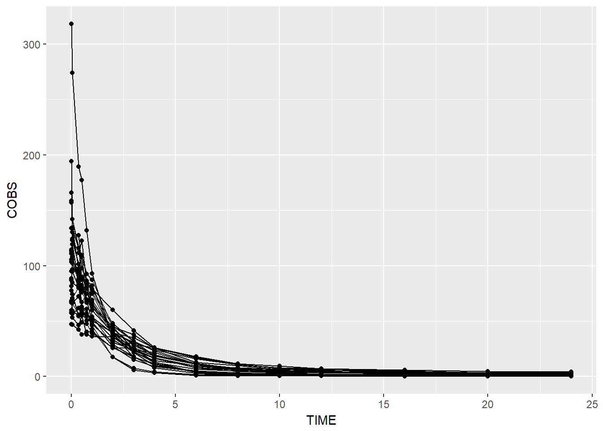
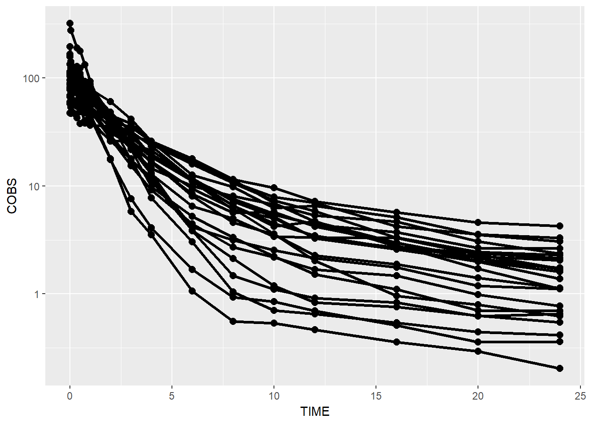
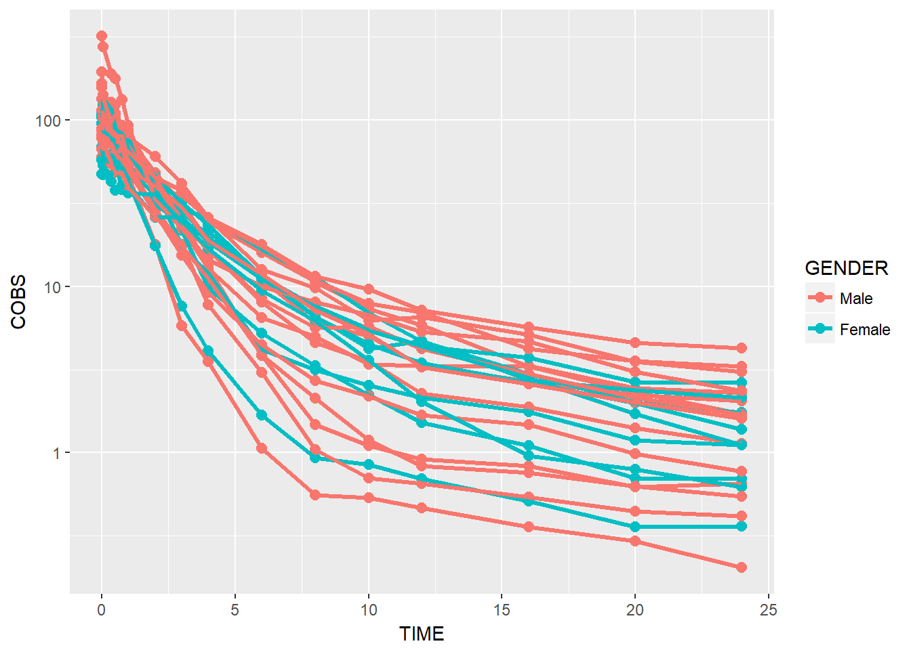
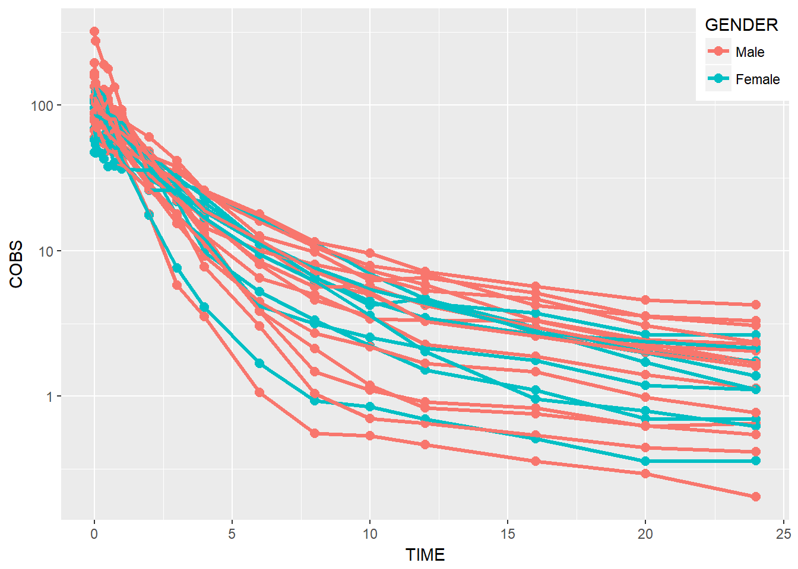
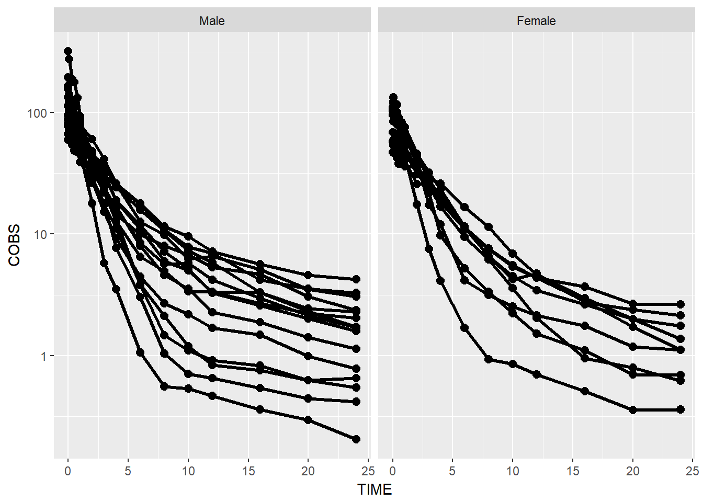
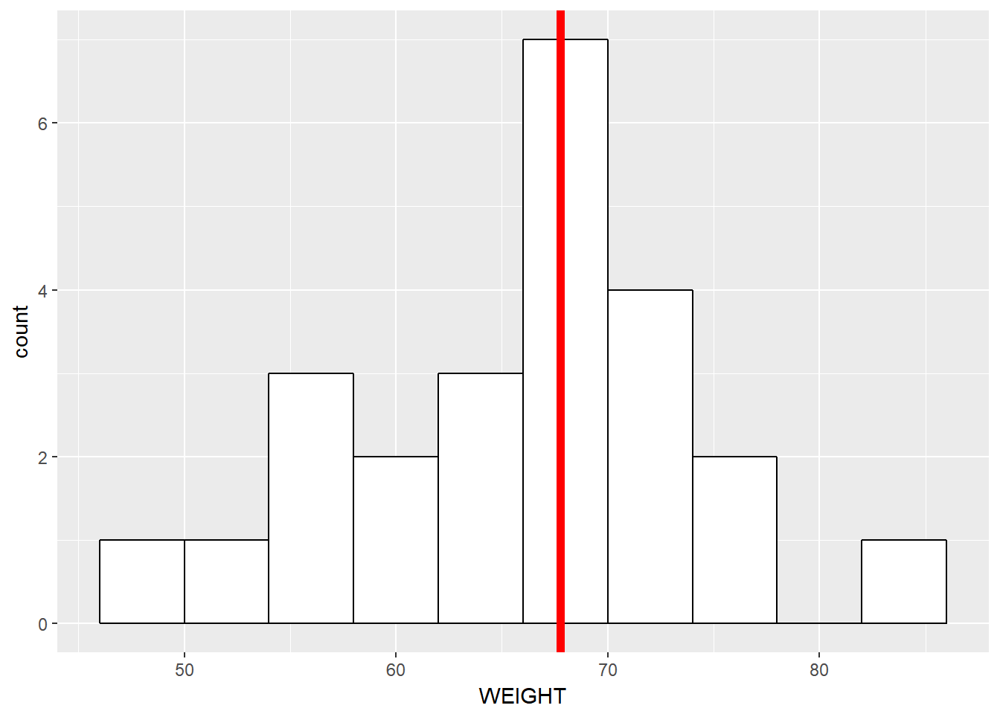

# Introduction to ggplot2


```r
library(PKPDmisc)
library(PKPDdatasets)
library(tidyverse)
#> Loading tidyverse: ggplot2
#> Loading tidyverse: tibble
#> Loading tidyverse: tidyr
#> Loading tidyverse: readr
#> Loading tidyverse: purrr
#> Loading tidyverse: dplyr
#> Conflicts with tidy packages ----------------------------------------------
#> filter(): dplyr, stats
#> lag():    dplyr, stats
```

## XY Plots
1) For concentration-time plots filter only OCC 1 from dapa_IV_oral (in PKPDdatasets) for subsequent plotting

```r
data1 <- dapa_IV_oral %>% filter(OCC == 1)
```

2) Basic Concentration-Time plot (point and lines)


```r
data1 %>% ggplot(aes(x = TIME, y = COBS, group = ID)) +
  geom_point() + geom_line()
```



3) make points/lines bigger


```r
data1 %>% ggplot(aes(x = TIME, y = COBS, group = ID)) +
  geom_point(size = 2.5) + geom_line(size = 1.1)
```


4) add log transformation to y axis


```r
data1 %>% ggplot(aes(x = TIME, y = COBS, group = ID)) +
  geom_point(size = 2.5) + geom_line(size = 1.1) +
  scale_y_log10()
```



5) Add color by gender


```r
data1 %>% 
    ggplot(aes(x = TIME, y = COBS, group = ID, color = GENDER)) +
    geom_point(size = 2.5) + geom_line(size = 1.1) +
    scale_y_log10()
```


BONUS: rename labels legend


```r
data1 %>% 
    ggplot(aes(x = TIME, y = COBS, group = ID, color = GENDER)) +
    geom_point(size = 2.5) + geom_line(size = 1.1) +
    scale_y_log10() + scale_color_discrete(labels = c("Male", "Female"))
```



BONUS: move legend to top right


```r
data1 %>% 
    ggplot(aes(x = TIME, y = COBS, group = ID, color = GENDER)) +
    geom_point(size = 2.5) + geom_line(size = 1.1) +
    scale_y_log10() + scale_color_discrete(labels = c("Male", "Female")) +
    theme(legend.position = c(1, 1), legend.justification = c(1, 1))
```



6) facet by race

Note, with facetting by race, the color becomes unnessary extra visual stimulus so we remove the color.


```r
data1 %>% 
    ggplot(aes(x = TIME, y = COBS, group = ID)) +
    geom_point(size = 2.5) + geom_line(size = 1.1) +
    scale_y_log10() +
    theme(legend.position = c(1, 1), legend.justification = c(1, 1)) +
    facet_wrap(~GENDER)
```


BONUS: rename facet strips by name

There are a couple ways of doing this:

1) on the fly mutate the the values to labels


```r
data1 %>% 
  mutate(GENDER = factor(GENDER, 
                         levels = c(0, 1), 
                         labels = c("Male", "Female"))) %>%
           ggplot(aes(x = TIME, y = COBS, group = ID)) +
  geom_point(size = 2.5) + geom_line(size = 1.1) +
  scale_y_log10() +
    theme(legend.position = c(1, 1), legend.justification = c(1, 1)) +
  facet_wrap(~GENDER)
```



Use facet_grid with the labeller argument


```r
data1 %>% 
   ggplot(aes(x = TIME, y = COBS, group = ID)) +
  geom_point(size = 2.5) + geom_line(size = 1.1) +
  scale_y_log10() +
    theme(legend.position = c(1, 1), legend.justification = c(1, 1)) +
  facet_grid(.~GENDER, labeller = label_both)
```


*note: the newest version of ggplot2 has changed the labeller behavior, when you have a factor that you want to
display both the underlying value and the label, you should now use `labeller = labe_both`, as shown below
7) add mean conc-time profile and color red

```r
data1 %>% 
   ggplot(aes(x = TIME, y = COBS, group = ID)) +
  geom_point(size = 2.5) + geom_line(size = 1.1) +
  scale_y_log10() +
    theme(legend.position = c(1, 1), legend.justification = c(1, 1)) +
  facet_grid(.~GENDER, labeller = label_both) +
  geom_line(data = data1 %>% group_by(TIME) %>%
              summarize(meanCONC = mean(COBS)), 
            aes(x = TIME, y = meanCONC, group = NULL), size = 1.25, color = "red")
```


8) add two mean profiles (one for each gender)


```r
data1 %>% 
   ggplot(aes(x = TIME, y = COBS, group = ID)) +
  geom_point(size = 2.5) + geom_line(size = 1.1) +
  scale_y_log10() +
    theme(legend.position = c(1, 1), legend.justification = c(1, 1)) +
  facet_grid(.~GENDER, labeller = label_both) +
  geom_line(data = data1 %>% 
              group_by(TIME, GENDER) %>%
              summarize(meanCONC = mean(COBS)), 
            aes(x = TIME, 
                y = meanCONC, 
                group = GENDER, 
                color = GENDER), 
            size = 1.25) + 
    scale_color_discrete(name = "Mean Profile", labels = c("Male", "Female"))
```


9) color by weight


```r
data1 %>% 
   ggplot(aes(x = TIME, y = COBS, group = ID, color = WEIGHT)) +
  geom_point(size = 2.5) + geom_line(size = 1.1) +
  scale_y_log10() +
    theme(legend.position = c(1, 1), legend.justification = c(1, 1))
```


BONUS: rename axes


```r
data1 %>% 
   ggplot(aes(x = TIME, y = COBS, group = ID, color = WEIGHT)) +
  geom_point(size = 2.5) + geom_line(size = 1.1) +
  scale_y_log10() +
    theme(legend.position = c(1, 1), legend.justification = c(1, 1)) +
  xlab("Time, hours") + ylab("Concentration, ug/mL")
```



```r
# alternative to xlab/ylab is declare all at once
# labs(list(x = "Time, hours", y = "Concentration, ug/mL"))
```

BONUS: additional customizations


```r
data1 %>% 
   ggplot(aes(x = TIME, y = COBS, group = ID, color = WEIGHT)) +
  geom_point(size = 2.5) + geom_line(size = 1.1) +
  scale_y_log10() +
    theme(legend.position = c(1, 1), legend.justification = c(1, 1)) +
  xlab("Time, hours") + ylab("Concentration, ug/mL") +
  # all these theme customizations are defined in PKPDmisc::base_theme()
  # however I wanted to show what the individual customizations looked like
  # so you can play around and test various
theme(legend.text = element_text(size = 10),
     legend.title = element_text(size = 12),
     axis.title.x = element_text(size = 12, face = "bold"),
     axis.title.y = element_text(size = 12, face = "bold"),
     axis.text.x = element_text(color = "black", size = 10),
     axis.text.y = element_text(color = "black", size = 10))
```


## Boxplots and Histograms
* Histogram(s) of demographics

```r
sid_data <- data1 %>% distinct(ID, .keep_all = TRUE) # single row per id data

sid_data %>%
ggplot(aes(x = WEIGHT)) + 
  geom_histogram(binwidth= 4, color="black", fill="white")
```


  * add vertical line for median value

```r
 median <- sid_data %>% summarize(medianWT = median(WEIGHT))
 # alternative explicit declaration of data inside ggplot rather than outside using %>%
ggplot(data = sid_data, 
       aes(x = WEIGHT)) + 
  geom_histogram(binwidth= 4, color="black", fill="white") +
  geom_vline(xintercept = median[["medianWT"]], size= 2, color = "red")
```


* Boxplot cmax/AUC by gender

```r
cmaxauc <- data1 %>% group_by(ID, GENDER) %>% 
    summarize(cmax = max(COBS), aucinf = auc_inf(TIME, COBS))
ggplot(cmaxauc, aes(x = GENDER, y = cmax, group = GENDER)) + geom_boxplot()
```


```r
ggplot(cmaxauc, aes(x = GENDER, y = aucinf, group = GENDER)) + geom_boxplot()
```


```r
devtools::session_info()
#> Session info --------------------------------------------------------------
#>  setting  value                       
#>  version  R version 3.3.2 (2016-10-31)
#>  system   x86_64, mingw32             
#>  ui       RTerm                       
#>  language (EN)                        
#>  collate  English_United States.1252  
#>  tz       America/New_York            
#>  date     2016-11-22
#> Packages ------------------------------------------------------------------
#>  package      * version    date      
#>  assertthat     0.1        2013-12-06
#>  bookdown       0.2        2016-11-12
#>  codetools      0.2-15     2016-10-05
#>  colorspace     1.2-7      2016-10-11
#>  DBI            0.5-1      2016-09-10
#>  devtools       1.12.0     2016-06-24
#>  digest         0.6.10     2016-08-02
#>  dplyr        * 0.5.0      2016-06-24
#>  evaluate       0.10       2016-10-11
#>  ggplot2      * 2.1.0.9001 2016-11-07
#>  gtable         0.2.0      2016-02-26
#>  htmltools      0.3.5      2016-03-21
#>  httpuv         1.3.3      2015-08-04
#>  knitr          1.15       2016-11-09
#>  labeling       0.3        2014-08-23
#>  lazyeval       0.2.0      2016-06-12
#>  magrittr       1.5        2014-11-22
#>  memoise        1.0.0      2016-01-29
#>  mime           0.5        2016-07-07
#>  miniUI         0.1.1      2016-01-15
#>  munsell        0.4.3      2016-02-13
#>  PKPDdatasets * 0.1.0      2016-11-02
#>  PKPDmisc     * 0.4.4.9000 2016-11-02
#>  plyr           1.8.4      2016-06-08
#>  purrr        * 0.2.2      2016-06-18
#>  R6             2.2.0      2016-10-05
#>  Rcpp           0.12.7     2016-09-05
#>  readr        * 1.0.0      2016-08-03
#>  reshape2       1.4.2      2016-10-22
#>  rmarkdown      1.1        2016-10-16
#>  scales         0.4.0.9003 2016-11-07
#>  shiny          0.14.2     2016-11-01
#>  stringi        1.1.2      2016-10-01
#>  stringr        1.1.0      2016-08-19
#>  tibble       * 1.2        2016-08-26
#>  tidyr        * 0.6.0      2016-08-12
#>  tidyverse    * 1.0.0      2016-09-09
#>  withr          1.0.2      2016-06-20
#>  xtable         1.8-2      2016-02-05
#>  yaml           2.1.13     2014-06-12
#>  source                                
#>  CRAN (R 3.3.2)                        
#>  CRAN (R 3.3.2)                        
#>  CRAN (R 3.3.2)                        
#>  CRAN (R 3.3.2)                        
#>  CRAN (R 3.3.2)                        
#>  CRAN (R 3.3.2)                        
#>  CRAN (R 3.3.2)                        
#>  CRAN (R 3.3.2)                        
#>  CRAN (R 3.3.2)                        
#>  Github (hadley/ggplot2@70c3d69)       
#>  CRAN (R 3.3.2)                        
#>  CRAN (R 3.3.2)                        
#>  CRAN (R 3.3.2)                        
#>  CRAN (R 3.3.2)                        
#>  CRAN (R 3.3.2)                        
#>  CRAN (R 3.3.2)                        
#>  CRAN (R 3.3.2)                        
#>  CRAN (R 3.3.2)                        
#>  CRAN (R 3.3.2)                        
#>  CRAN (R 3.3.2)                        
#>  CRAN (R 3.3.2)                        
#>  Github (dpastoor/PKPDdatasets@52880fa)
#>  Github (dpastoor/PKPDmisc@beae2a6)    
#>  CRAN (R 3.3.2)                        
#>  CRAN (R 3.3.2)                        
#>  CRAN (R 3.3.2)                        
#>  CRAN (R 3.3.2)                        
#>  CRAN (R 3.3.2)                        
#>  CRAN (R 3.3.2)                        
#>  CRAN (R 3.3.2)                        
#>  Github (hadley/scales@d58d83a)        
#>  CRAN (R 3.3.2)                        
#>  CRAN (R 3.3.2)                        
#>  CRAN (R 3.3.2)                        
#>  CRAN (R 3.3.2)                        
#>  CRAN (R 3.3.2)                        
#>  CRAN (R 3.3.2)                        
#>  CRAN (R 3.3.2)                        
#>  CRAN (R 3.3.2)                        
#>  CRAN (R 3.3.2)
```

