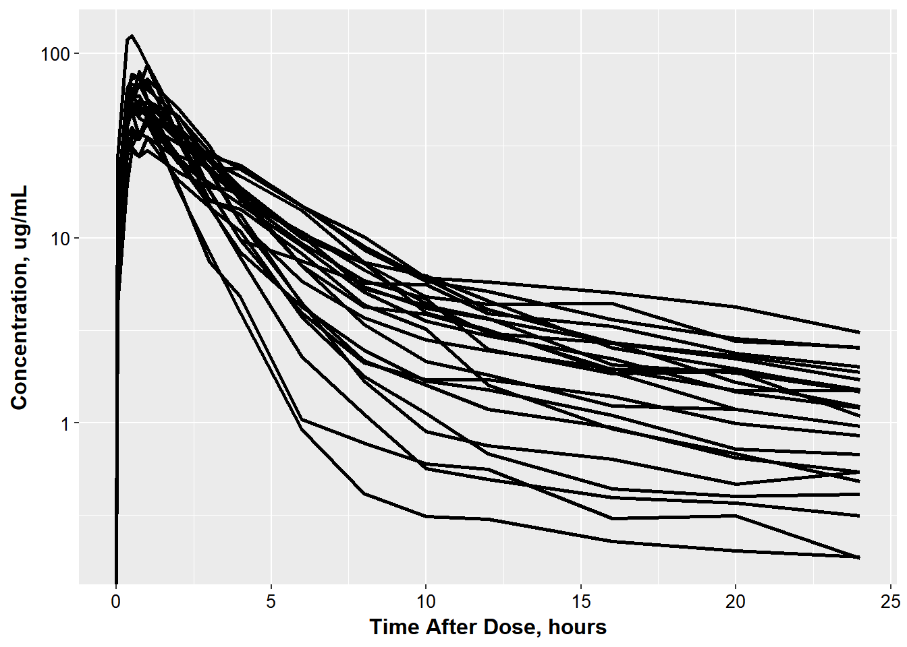

# advanced ggplot customizations

Help! Your colleague Jon has come to you for help. He is just starting to use ggplot and is having trouble. Thankfully, he has gotten started on making the necessary plots, and has a good idea what he wants. Your job, should you choose to accept it, is to help finish off the plots Jon has started. 


Jon has been kind enough to provide you with a zipped R project. You can unzip the project and click on the .Rproj to open up the project to get you started. 


```r
library(tidyverse, warn.conflicts = FALSE)
#> Loading tidyverse: ggplot2
#> Loading tidyverse: tibble
#> Loading tidyverse: tidyr
#> Loading tidyverse: readr
#> Loading tidyverse: purrr
#> Loading tidyverse: dplyr
#> Conflicts with tidy packages ----------------------------------------------
#> filter(): dplyr, stats
#> lag():    dplyr, stats
library(knitr)
library(PKPDdatasets)
library(PKPDmisc) 
opts_chunk$set(cache=T, fig.width=9)
```

The data Jon is working with conventiently comes from the `dapa_iv_oral` dataset in the `PKPDdatasets` package.

Jon's first attempt to make a concentration time plot for each ID looks funny. 


```r
oral_data <- dapa_IV_oral %>% filter(FORMULATION == "ORAL")
```


```r
kable(head(oral_data))
```


 ID   TIME    TAD   COBS   AMT_IV   AMT_ORAL   OCC   AGE   WEIGHT  GENDER   FORMULATION 
---  -----  -----  -----  -------  ---------  ----  ----  -------  -------  ------------
  1    168   0.00    0.0        0       5000     2    44     70.5  0        ORAL        
  1    168   0.05   13.7        0          0     2    44     70.5  0        ORAL        
  1    168   0.35   62.3        0          0     2    44     70.5  0        ORAL        
  1    168   0.50   67.9        0          0     2    44     70.5  0        ORAL        
  1    169   0.75   66.3        0          0     2    44     70.5  0        ORAL        
  1    169   1.00   86.3        0          0     2    44     70.5  0        ORAL        


```r
ggplot(oral_data, 
       aes(x = TAD, y = COBS, group = ID, color = OCC)) + 
    geom_line() + 
  facet_wrap(~ID)
```


You will need to help him adjust:

* fix lines (hint - check out `interaction`)
* fix line color to be discrete
* rename axes
* change legend name
* adjust scale
* adjust axis labels and numbers for text color and size
* adjust the output width so the x-axis numbers don't overlap

### to get a final plot that looks like this:


```r
ggplot(oral_data, aes(x = TAD, y = COBS, 
                      group = interaction(ID, OCC), 
                      color = factor(OCC))) + 
  geom_line(size = 1.05) + 
  facet_wrap(~ID) + base_theme() +
  xlab("Time After Dose, hours") +
  ylab("Concentration, ug/mL") +
  scale_color_discrete(name="Occasion") + scale_y_log10()
#> Warning: Transformation introduced infinite values in continuous y-axis
```


Jon now wants to get a general feel for the covariate weight, and thus wants to color by weight.


```r
ggplot(oral_data, aes(x = TAD, y = COBS, 
                      group = ID)) + 
  geom_line(size = 1.05) + 
  facet_wrap(~OCC) + base_theme() +
  xlab("Time After Dose, hours") +
  ylab("Concentration, ug/mL") +
 scale_y_log10()
#> Warning: Transformation introduced infinite values in continuous y-axis
```


He needs your help

* fixing the facet strips to be better labeled
* add the color to weight
* getting the plots to be row-wise rather than side-by-side


### so it will look like this:


```r
occ_labels <- c(
    '1' = "5 mg IV", 
    '2'= "5 mg",
    '3' = "10 mg",
    '4' = "25 mg"
)

ct_colWT <- ggplot(oral_data, aes(x = TAD, y = COBS, 
                      group = interaction(ID, OCC), 
                      color = WEIGHT)) + 
  geom_line(size = 1.05) + 
 base_theme() +
  xlab("Time After Dose, hours") +
  ylab("Concentration, ug/mL") +
 scale_y_log10() 
```


```r
ct_colWT + 
    facet_grid(OCC~., labeller=labeller(OCC = occ_labels)) +
    theme(strip.text = element_text(size = 16, color="black"))
#> Warning: Transformation introduced infinite values in continuous y-axis
```


But just in case also wants to see the old side-by-side view as well. 

He needs your help

* change facetting
* move legend to be below the plot

### so it looks like this:


```r
ct_colWT + 
    facet_grid(OCC~., labeller=labeller(OCC = occ_labels)) +
    theme(strip.text = element_text(size = 16, color="black")) +
    theme(legend.position="bottom")
#> Warning: Transformation introduced infinite values in continuous y-axis
```


Jon decided to look at the 5 mg dose. He needs help figuring out how to add mean lines. He wants to show that the general trend for males and females is similar and so would like to overlay the geometric mean profile for males and females on the concentration-time plot below.


```r
oral_data_occ2 <- oral_data %>% filter(OCC==2)

# calculate geometric mean here
```

He did a couple calculations by hand so you can check that the values are the same.

```r
mean_occ2 <- oral_data %>% 
    filter(OCC==2) %>%
    group_by(GENDER, TAD) %>% 
    summarize(meanCONC = round(exp(mean(log(COBS))),3))

head(mean_occ2, n = 3)
#> # A tibble: 3 x 3
#> # Groups:   GENDER [1]
#>   GENDER   TAD meanCONC
#>   <fctr> <dbl>    <dbl>
#> 1      0  0.00      0.0
#> 2      0  0.05     11.0
#> 3      0  0.35     47.6
tail(mean_occ2, n = 3)
#> # A tibble: 3 x 3
#> # Groups:   GENDER [1]
#>   GENDER   TAD meanCONC
#>   <fctr> <dbl>    <dbl>
#> 1      1    16    1.409
#> 2      1    20    1.081
#> 3      1    24    0.833
```

He's gotten started on the plot but can't figure out how to overlay the profiles.


```r
ggplot(oral_data_occ2, aes(x = TAD, y = COBS, 
                      group = ID)) + 
  geom_line(size = 1.05)+ base_theme() +
  xlab("Time After Dose, hours") +
  ylab("Concentration, ug/mL") + scale_y_log10()
#> Warning: Transformation introduced infinite values in continuous y-axis
```



To get the final result he asks you to:

* calculate the geometric mean values for males and females
* overlay the results and color by Gender
* update the legend with the name 'Gender' and Male/Female Labels
* move the legend to be in the top right corner inside the plot
* add another break in the y axis for 50

### So it looks like this:


```r
ggplot(oral_data_occ2, aes(x = TAD, y = COBS, 
                      group = ID)) + 
    geom_line(size = 1.05)+ 
    base_theme() +
    xlab("Time After Dose, hours") +
    ylab("Concentration, ug/mL") +
    scale_color_discrete(name="Gender", 
                       labels= c("Male", "Female")) + 
    scale_y_log10(breaks = c(1, 10 , 50, 100)) +
    geom_line(data = mean_occ2, 
            aes(x = TAD, 
                y = meanCONC, 
                group = GENDER, 
                color = GENDER
                ), size = 1.5)+ 
    theme(legend.justification=c(1,1), legend.position=c(1,1))
#> Warning: Transformation introduced infinite values in continuous y-axis

#> Warning: Transformation introduced infinite values in continuous y-axis
```


```r
devtools::session_info()
#> Session info -------------------------------------------------------------
#>  setting  value                       
#>  version  R version 3.4.0 (2017-04-21)
#>  system   x86_64, mingw32             
#>  ui       RTerm                       
#>  language (EN)                        
#>  collate  English_United States.1252  
#>  tz       Europe/Prague               
#>  date     2017-06-05
#> Packages -----------------------------------------------------------------
#>  package      * version  date       source                                
#>  assertthat     0.2.0    2017-04-11 CRAN (R 3.4.0)                        
#>  backports      1.1.0    2017-05-22 CRAN (R 3.4.0)                        
#>  base         * 3.4.0    2017-04-21 local                                 
#>  bindr          0.1      2016-11-13 CRAN (R 3.4.0)                        
#>  bindrcpp     * 0.1      2016-12-11 CRAN (R 3.4.0)                        
#>  bookdown       0.4      2017-05-20 CRAN (R 3.4.0)                        
#>  broom          0.4.2    2017-02-13 CRAN (R 3.4.0)                        
#>  cellranger     1.1.0    2016-07-27 CRAN (R 3.4.0)                        
#>  codetools      0.2-15   2016-10-05 CRAN (R 3.4.0)                        
#>  colorspace     1.3-2    2016-12-14 CRAN (R 3.4.0)                        
#>  compiler       3.4.0    2017-04-21 local                                 
#>  datasets     * 3.4.0    2017-04-21 local                                 
#>  devtools       1.13.1   2017-05-13 CRAN (R 3.4.0)                        
#>  digest         0.6.12   2017-01-27 CRAN (R 3.4.0)                        
#>  dplyr        * 0.6.0    2017-06-02 Github (tidyverse/dplyr@b064c4b)      
#>  evaluate       0.10     2016-10-11 CRAN (R 3.4.0)                        
#>  forcats        0.2.0    2017-01-23 CRAN (R 3.4.0)                        
#>  foreign        0.8-67   2016-09-13 CRAN (R 3.4.0)                        
#>  ggplot2      * 2.2.1    2016-12-30 CRAN (R 3.4.0)                        
#>  glue           1.0.0    2017-04-17 CRAN (R 3.4.0)                        
#>  graphics     * 3.4.0    2017-04-21 local                                 
#>  grDevices    * 3.4.0    2017-04-21 local                                 
#>  grid           3.4.0    2017-04-21 local                                 
#>  gtable         0.2.0    2016-02-26 CRAN (R 3.4.0)                        
#>  haven          1.0.0    2016-09-23 CRAN (R 3.4.0)                        
#>  highr          0.6      2016-05-09 CRAN (R 3.4.0)                        
#>  hms            0.3      2016-11-22 CRAN (R 3.4.0)                        
#>  htmltools      0.3.6    2017-04-28 CRAN (R 3.4.0)                        
#>  httr           1.2.1    2016-07-03 CRAN (R 3.4.0)                        
#>  jsonlite       1.5      2017-06-01 CRAN (R 3.4.0)                        
#>  knitr        * 1.16     2017-05-18 CRAN (R 3.4.0)                        
#>  labeling       0.3      2014-08-23 CRAN (R 3.4.0)                        
#>  lattice        0.20-35  2017-03-25 CRAN (R 3.4.0)                        
#>  lazyeval       0.2.0    2016-06-12 CRAN (R 3.4.0)                        
#>  lubridate      1.6.0    2016-09-13 CRAN (R 3.4.0)                        
#>  magrittr       1.5      2014-11-22 CRAN (R 3.4.0)                        
#>  memoise        1.1.0    2017-04-21 CRAN (R 3.4.0)                        
#>  methods        3.4.0    2017-04-21 local                                 
#>  mnormt         1.5-5    2016-10-15 CRAN (R 3.4.0)                        
#>  modelr         0.1.0    2016-08-31 CRAN (R 3.4.0)                        
#>  munsell        0.4.3    2016-02-13 CRAN (R 3.4.0)                        
#>  nlme           3.1-131  2017-02-06 CRAN (R 3.4.0)                        
#>  parallel       3.4.0    2017-04-21 local                                 
#>  PKPDdatasets * 0.1.0    2017-06-02 Github (dpastoor/PKPDdatasets@9eaa831)
#>  PKPDmisc     * 1.0.0    2017-06-02 Github (dpastoor/PKPDmisc@23e1f49)    
#>  plyr           1.8.4    2016-06-08 CRAN (R 3.4.0)                        
#>  psych          1.7.5    2017-05-03 CRAN (R 3.4.0)                        
#>  purrr        * 0.2.2.2  2017-05-11 CRAN (R 3.4.0)                        
#>  R6             2.2.1    2017-05-10 CRAN (R 3.4.0)                        
#>  Rcpp           0.12.11  2017-05-22 CRAN (R 3.4.0)                        
#>  readr        * 1.1.1    2017-05-16 CRAN (R 3.4.0)                        
#>  readxl         1.0.0    2017-04-18 CRAN (R 3.4.0)                        
#>  reshape2       1.4.2    2016-10-22 CRAN (R 3.4.0)                        
#>  rlang          0.1.1    2017-05-18 CRAN (R 3.4.0)                        
#>  rmarkdown      1.5.9000 2017-06-03 Github (rstudio/rmarkdown@ea515ef)    
#>  rprojroot      1.2      2017-01-16 CRAN (R 3.4.0)                        
#>  rvest          0.3.2    2016-06-17 CRAN (R 3.4.0)                        
#>  scales         0.4.1    2016-11-09 CRAN (R 3.4.0)                        
#>  stats        * 3.4.0    2017-04-21 local                                 
#>  stringi        1.1.5    2017-04-07 CRAN (R 3.4.0)                        
#>  stringr        1.2.0    2017-02-18 CRAN (R 3.4.0)                        
#>  tibble       * 1.3.3    2017-05-28 CRAN (R 3.4.0)                        
#>  tidyr        * 0.6.3    2017-05-15 CRAN (R 3.4.0)                        
#>  tidyverse    * 1.1.1    2017-01-27 CRAN (R 3.4.0)                        
#>  tools          3.4.0    2017-04-21 local                                 
#>  utils        * 3.4.0    2017-04-21 local                                 
#>  withr          1.0.2    2016-06-20 CRAN (R 3.4.0)                        
#>  xml2           1.1.1    2017-01-24 CRAN (R 3.4.0)                        
#>  yaml           2.1.14   2016-11-12 CRAN (R 3.4.0)
```

