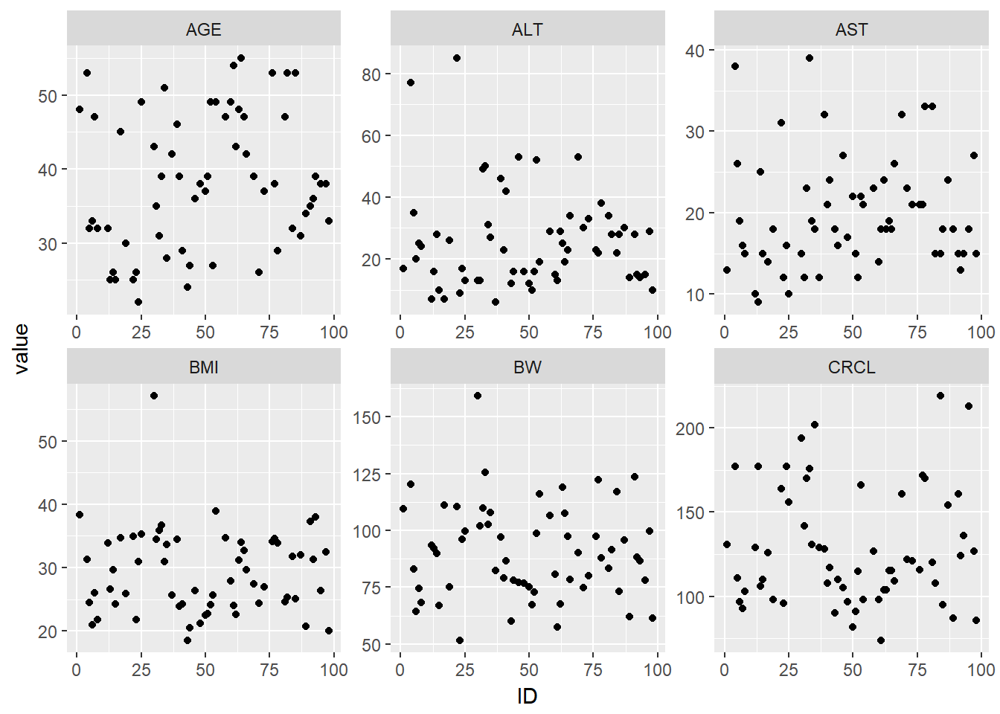
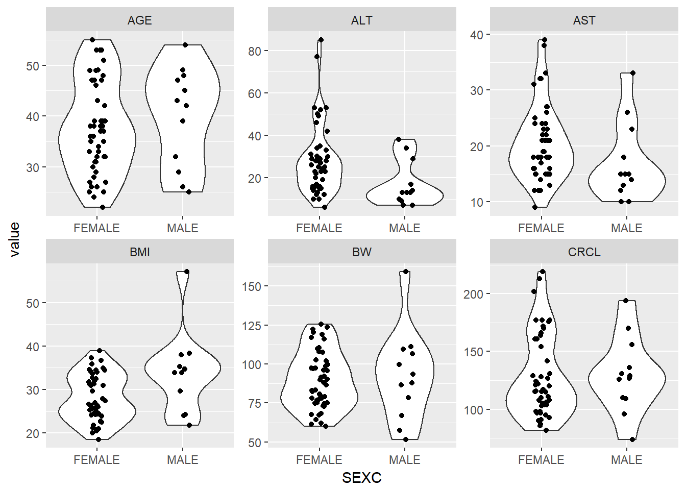
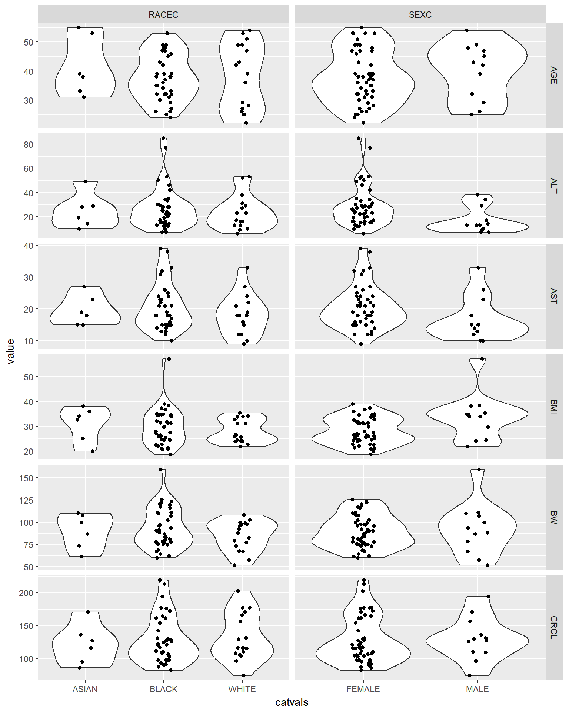

# Tidying Data


```r
library(knitr)
library(tidyverse)
#> Loading tidyverse: ggplot2
#> Loading tidyverse: tibble
#> Loading tidyverse: tidyr
#> Loading tidyverse: readr
#> Loading tidyverse: purrr
#> Loading tidyverse: dplyr
#> Conflicts with tidy packages ----------------------------------------------
#> filter(): dplyr, stats
#> lag():    dplyr, stats
library(PKPDmisc)
```


```r
ebe_cov <- read_csv("../data/ebe_cov.csv")
#> Parsed with column specification:
#> cols(
#>   ID = col_integer(),
#>   ETA1 = col_double(),
#>   ETA2 = col_double(),
#>   ETA3 = col_integer(),
#>   ETA4 = col_double(),
#>   ETA5 = col_double(),
#>   ETA6 = col_double(),
#>   ETA7 = col_double(),
#>   ETA8 = col_double(),
#>   ETA9 = col_double(),
#>   BW = col_double(),
#>   BMI = col_double(),
#>   AGE = col_integer(),
#>   AST = col_integer(),
#>   ALT = col_integer(),
#>   CRCL = col_double(),
#>   SEX = col_integer(),
#>   RACE = col_integer()
#> )
```

Remove all the columns with ETAS and name dataframe `covs`


```r
covs <- ebe_cov %>% select(-contains("ETA"))
```

Find all columns with an NA value, and the associated ID


```r
has_missing <- covs %>% 
  group_by(ID) %>%
  select_if(~any(is.na(.))) %>%
  ungroup()
head(has_missing)
#> # A tibble: 6 x 3
#>      ID    BW   SEX
#>   <int> <dbl> <int>
#> 1     1 109.4     1
#> 2     4 120.2     0
#> 3     5  83.0     0
#> 4     6  64.2     0
#> 5     7  74.4     0
#> 6     8  68.4     0

missing_ids <- has_missing %>%
  gather(cov, values, -ID) %>%
  filter(is.na(values))
missing_ids
#> # A tibble: 2 x 3
#>      ID   cov values
#>   <int> <chr>  <dbl>
#> 1    69    BW     NA
#> 2    65   SEX     NA
```

Impute the NA values using the mean for any continous variable, and largest group for categorical


```r
has_missing %>%
  select(-ID) %>%
  mutate(SEX = as.factor(SEX)) %>% summary
#>        BW          SEX    
#>  Min.   : 51.7   0   :48  
#>  1st Qu.: 75.2   1   :12  
#>  Median : 88.1   NA's: 1  
#>  Mean   : 90.3            
#>  3rd Qu.:103.6            
#>  Max.   :159.2            
#>  NA's   :1
```


```r
replacement_values <- has_missing %>% 
  summarize(BW = mean(BW, na.rm = T)) %>% 
  mutate(SEX = 0)
```


```r
covs <- covs %>% 
  replace_na(replace = as.list(replacement_values)) 
```


```r
covs %>%
  filter(ID %in% missing_ids$ID)
#> # A tibble: 2 x 9
#>      ID    BW   BMI   AGE   AST   ALT  CRCL   SEX  RACE
#>   <int> <dbl> <dbl> <int> <int> <int> <dbl> <dbl> <int>
#> 1    65  97.5  32.7    47    18    23   116     0     0
#> 2    69  90.3  27.5    39    32    53   161     0     1
```

## data checkout for all covariates

Set all categorical covariates to factors with appropriate labels


```r
covs_f <- covs %>% 
  mutate(SEXC = factor(SEX, 
                       levels = c(0, 1), 
                       labels = c("FEMALE", "MALE")
                       ),
        RACEC = factor(RACE, 
                       levels = c(0:2), 
                       labels = c("WHITE", "BLACK", "ASIAN")
                       )
         ) %>%
  select(-SEX, -RACE)
```


```r
g_cont_covs <- covs_f %>% gather(cov, value, BW:CRCL)
```

Plot a scatter plot of all continuous covariates versus ID to check for visual outliers


```r
g_cont_covs %>%
  ggplot(aes(x = ID, y = value)) +
  geom_point() +
  facet_wrap(~cov, scales = "free")
```



Plot a violin/box plot of all continuous covariates versus SEX to check for visual trends 


```r
g_cont_covs %>%
  ggplot(aes(x = SEXC, y = value)) +
  geom_violin() +
  geom_jitter(width = 0.1) +
  facet_wrap(~cov, scales = "free")
```



Plot a violin/box plot of all continuous covariates versus all categorical covariates to check for visual trends 


```r
g_cont_covs %>%
  gather(catcov, catvals, RACEC, SEXC) %>%
  ggplot(aes(x = catvals, y = value)) +
  geom_violin() +
  geom_jitter(width = 0.1) +
  facet_grid(cov~catcov, scales = "free")
#> Warning: attributes are not identical across measure variables; they will
#> be dropped
```




```r
devtools::session_info()
#> Session info -------------------------------------------------------------
#>  setting  value                       
#>  version  R version 3.4.0 (2017-04-21)
#>  system   x86_64, mingw32             
#>  ui       RTerm                       
#>  language (EN)                        
#>  collate  English_United States.1252  
#>  tz       Europe/Prague               
#>  date     2017-06-05
#> Packages -----------------------------------------------------------------
#>  package    * version  date       source                            
#>  assertthat   0.2.0    2017-04-11 CRAN (R 3.4.0)                    
#>  backports    1.1.0    2017-05-22 CRAN (R 3.4.0)                    
#>  base       * 3.4.0    2017-04-21 local                             
#>  bindr        0.1      2016-11-13 CRAN (R 3.4.0)                    
#>  bindrcpp   * 0.1      2016-12-11 CRAN (R 3.4.0)                    
#>  bookdown     0.4      2017-05-20 CRAN (R 3.4.0)                    
#>  broom        0.4.2    2017-02-13 CRAN (R 3.4.0)                    
#>  cellranger   1.1.0    2016-07-27 CRAN (R 3.4.0)                    
#>  codetools    0.2-15   2016-10-05 CRAN (R 3.4.0)                    
#>  colorspace   1.3-2    2016-12-14 CRAN (R 3.4.0)                    
#>  compiler     3.4.0    2017-04-21 local                             
#>  datasets   * 3.4.0    2017-04-21 local                             
#>  devtools     1.13.1   2017-05-13 CRAN (R 3.4.0)                    
#>  digest       0.6.12   2017-01-27 CRAN (R 3.4.0)                    
#>  dplyr      * 0.6.0    2017-06-02 Github (tidyverse/dplyr@b064c4b)  
#>  evaluate     0.10     2016-10-11 CRAN (R 3.4.0)                    
#>  forcats      0.2.0    2017-01-23 CRAN (R 3.4.0)                    
#>  foreign      0.8-67   2016-09-13 CRAN (R 3.4.0)                    
#>  ggplot2    * 2.2.1    2016-12-30 CRAN (R 3.4.0)                    
#>  glue         1.0.0    2017-04-17 CRAN (R 3.4.0)                    
#>  graphics   * 3.4.0    2017-04-21 local                             
#>  grDevices  * 3.4.0    2017-04-21 local                             
#>  grid         3.4.0    2017-04-21 local                             
#>  gtable       0.2.0    2016-02-26 CRAN (R 3.4.0)                    
#>  haven        1.0.0    2016-09-23 CRAN (R 3.4.0)                    
#>  hms          0.3      2016-11-22 CRAN (R 3.4.0)                    
#>  htmltools    0.3.6    2017-04-28 CRAN (R 3.4.0)                    
#>  httr         1.2.1    2016-07-03 CRAN (R 3.4.0)                    
#>  jsonlite     1.5      2017-06-01 CRAN (R 3.4.0)                    
#>  knitr      * 1.16     2017-05-18 CRAN (R 3.4.0)                    
#>  labeling     0.3      2014-08-23 CRAN (R 3.4.0)                    
#>  lattice      0.20-35  2017-03-25 CRAN (R 3.4.0)                    
#>  lazyeval     0.2.0    2016-06-12 CRAN (R 3.4.0)                    
#>  lubridate    1.6.0    2016-09-13 CRAN (R 3.4.0)                    
#>  magrittr     1.5      2014-11-22 CRAN (R 3.4.0)                    
#>  memoise      1.1.0    2017-04-21 CRAN (R 3.4.0)                    
#>  methods      3.4.0    2017-04-21 local                             
#>  mnormt       1.5-5    2016-10-15 CRAN (R 3.4.0)                    
#>  modelr       0.1.0    2016-08-31 CRAN (R 3.4.0)                    
#>  munsell      0.4.3    2016-02-13 CRAN (R 3.4.0)                    
#>  nlme         3.1-131  2017-02-06 CRAN (R 3.4.0)                    
#>  parallel     3.4.0    2017-04-21 local                             
#>  PKPDmisc   * 1.0.0    2017-06-02 Github (dpastoor/PKPDmisc@23e1f49)
#>  plyr         1.8.4    2016-06-08 CRAN (R 3.4.0)                    
#>  psych        1.7.5    2017-05-03 CRAN (R 3.4.0)                    
#>  purrr      * 0.2.2.2  2017-05-11 CRAN (R 3.4.0)                    
#>  R6           2.2.1    2017-05-10 CRAN (R 3.4.0)                    
#>  Rcpp         0.12.11  2017-05-22 CRAN (R 3.4.0)                    
#>  readr      * 1.1.1    2017-05-16 CRAN (R 3.4.0)                    
#>  readxl       1.0.0    2017-04-18 CRAN (R 3.4.0)                    
#>  reshape2     1.4.2    2016-10-22 CRAN (R 3.4.0)                    
#>  rlang        0.1.1    2017-05-18 CRAN (R 3.4.0)                    
#>  rmarkdown    1.5.9000 2017-06-03 Github (rstudio/rmarkdown@ea515ef)
#>  rprojroot    1.2      2017-01-16 CRAN (R 3.4.0)                    
#>  rvest        0.3.2    2016-06-17 CRAN (R 3.4.0)                    
#>  scales       0.4.1    2016-11-09 CRAN (R 3.4.0)                    
#>  stats      * 3.4.0    2017-04-21 local                             
#>  stringi      1.1.5    2017-04-07 CRAN (R 3.4.0)                    
#>  stringr      1.2.0    2017-02-18 CRAN (R 3.4.0)                    
#>  tibble     * 1.3.3    2017-05-28 CRAN (R 3.4.0)                    
#>  tidyr      * 0.6.3    2017-05-15 CRAN (R 3.4.0)                    
#>  tidyverse  * 1.1.1    2017-01-27 CRAN (R 3.4.0)                    
#>  tools        3.4.0    2017-04-21 local                             
#>  utils      * 3.4.0    2017-04-21 local                             
#>  withr        1.0.2    2016-06-20 CRAN (R 3.4.0)                    
#>  xml2         1.1.1    2017-01-24 CRAN (R 3.4.0)                    
#>  yaml         2.1.14   2016-11-12 CRAN (R 3.4.0)
```

