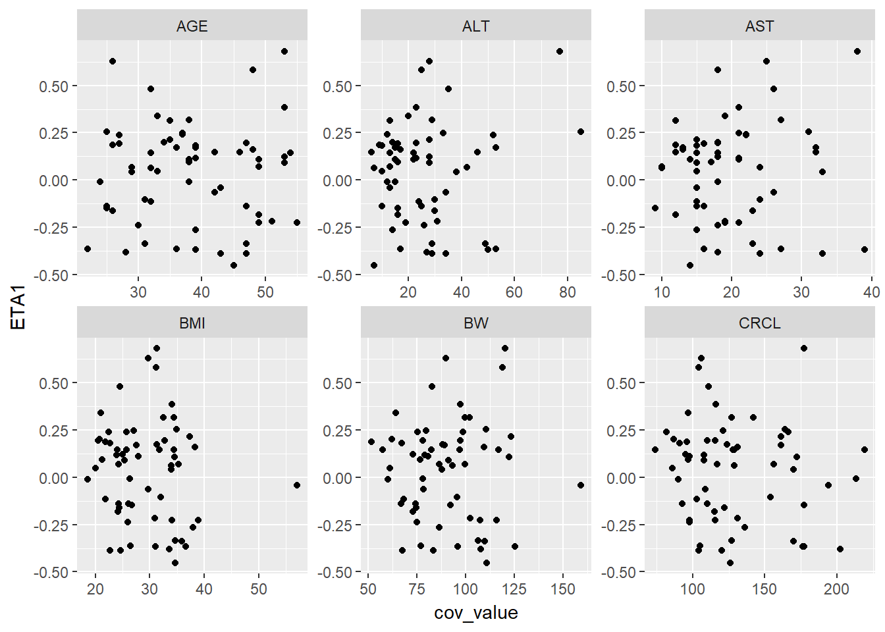
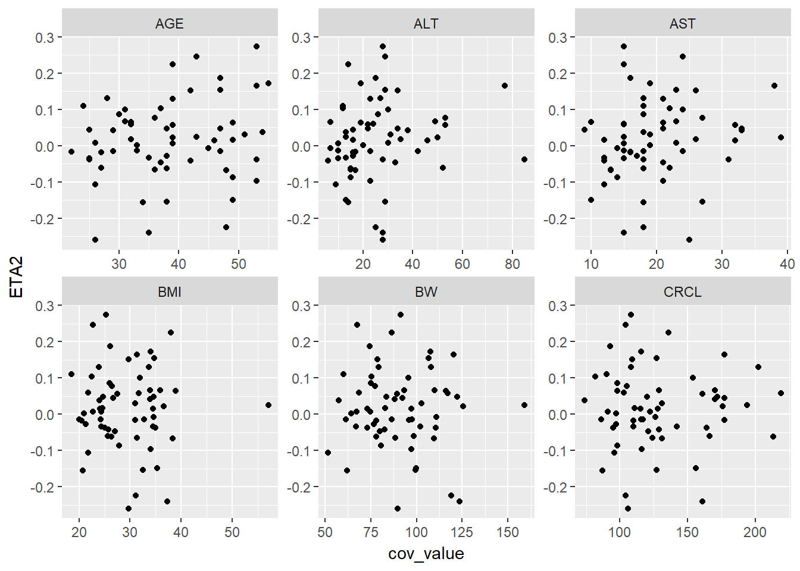
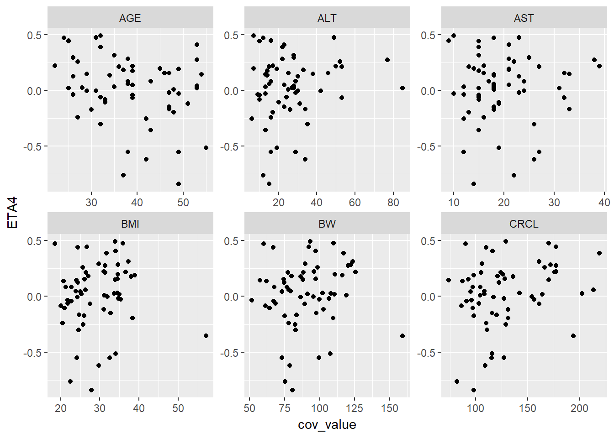
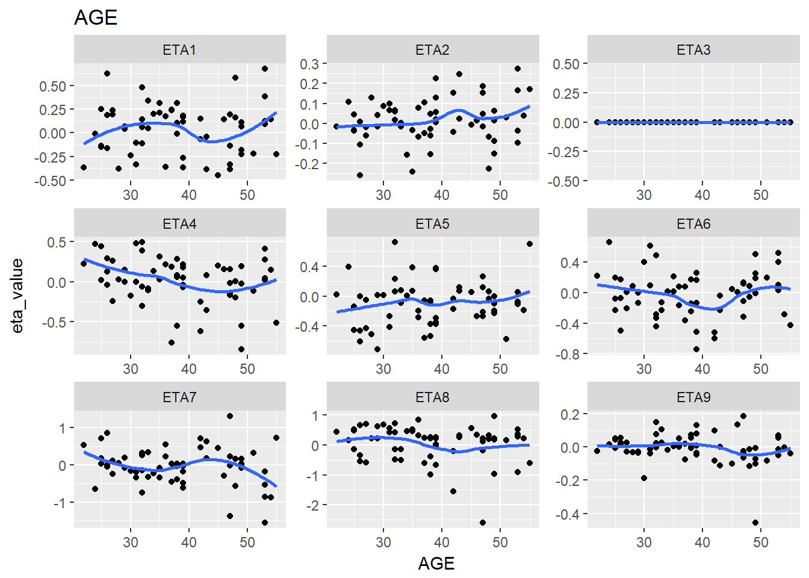
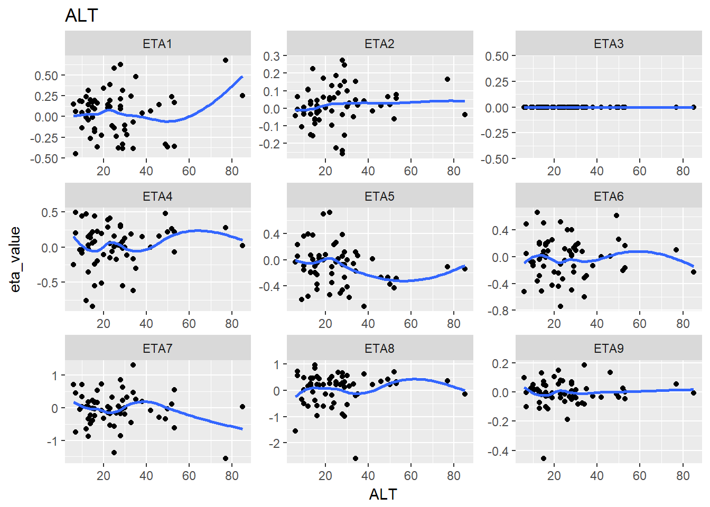
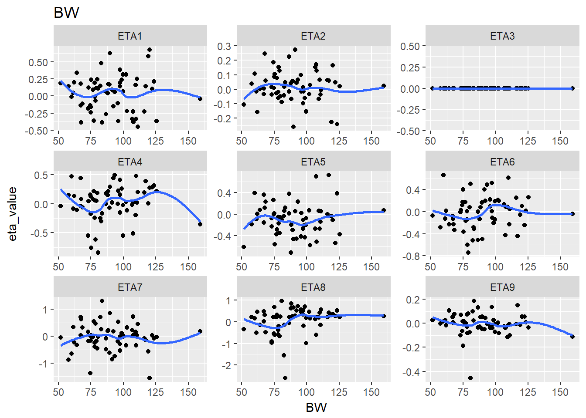
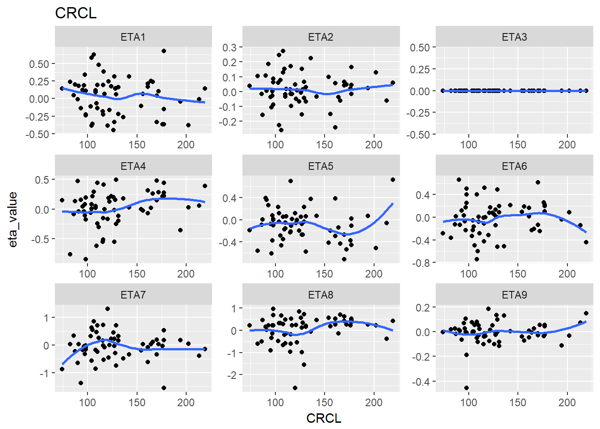

## Tidyr legacy


```r
library(PKPDmisc)
library(knitr)
library(lazyeval)
library(tidyverse)
#> Loading tidyverse: ggplot2
#> Loading tidyverse: tibble
#> Loading tidyverse: tidyr
#> Loading tidyverse: readr
#> Loading tidyverse: purrr
#> Loading tidyverse: dplyr
#> Conflicts with tidy packages ----------------------------------------------
#> filter():     dplyr, stats
#> is_formula(): purrr, lazyeval
#> lag():        dplyr, stats
```


```r
eta_cov <- read.csv("../data/ebe_cov_full.csv")
```


```r
kable(head(eta_cov))
```


 ID     ETA1     ETA2   ETA3     ETA4     ETA5     ETA6     ETA7     ETA8     ETA9      BW    BMI   AGE   AST   ALT   CRCL   SEX   RACE   ETHNIC
---  -------  -------  -----  -------  -------  -------  -------  -------  -------  ------  -----  ----  ----  ----  -----  ----  -----  -------
  1    0.160   -0.067      0   -0.195    0.058    0.083    0.167    0.204   -0.114   109.4   38.3    48    13    17    131     1      1        0
  4    0.681    0.165      0    0.276   -0.107    0.099   -1.562    0.355    0.056   120.2   31.3    53    38    77    177     0      1        0
  5    0.480    0.017      0   -0.302    0.062   -0.287    0.260   -0.152    0.022    83.0   24.5    32    26    35    111     0      1        0
  6    0.339    0.001      0   -0.105    0.079   -0.228   -0.326   -0.138    0.105    64.2   21.0    33    19    20     97     0      1        0
  7   -0.139    0.187      0    0.155    0.260    0.122   -1.381    0.220   -0.063    74.4   26.1    47    16    25     93     0      1        0
  8   -0.115    0.060      0   -0.063    0.230   -0.328    0.317   -0.492    0.076    68.4   21.8    32    15    24    103     0      1        0


```r

g_eta_cov <- eta_cov %>% 
    gather(cov_name, cov_value, BW:CRCL)
```


```r
kable(head(g_eta_cov))
```


 ID     ETA1     ETA2   ETA3     ETA4     ETA5     ETA6     ETA7     ETA8     ETA9   SEX   RACE   ETHNIC  cov_name    cov_value
---  -------  -------  -----  -------  -------  -------  -------  -------  -------  ----  -----  -------  ---------  ----------
  1    0.160   -0.067      0   -0.195    0.058    0.083    0.167    0.204   -0.114     1      1        0  BW              109.4
  4    0.681    0.165      0    0.276   -0.107    0.099   -1.562    0.355    0.056     0      1        0  BW              120.2
  5    0.480    0.017      0   -0.302    0.062   -0.287    0.260   -0.152    0.022     0      1        0  BW               83.0
  6    0.339    0.001      0   -0.105    0.079   -0.228   -0.326   -0.138    0.105     0      1        0  BW               64.2
  7   -0.139    0.187      0    0.155    0.260    0.122   -1.381    0.220   -0.063     0      1        0  BW               74.4
  8   -0.115    0.060      0   -0.063    0.230   -0.328    0.317   -0.492    0.076     0      1        0  BW               68.4


lazily evaluated function for ggplot plots


```r
eta_cov_scatter <- function(df, xval = "cov_value", yval, cov_name = "cov_name") {
  lazy_plot <- lazyeval::interp(~ggplot(df, aes(x = cov_value, y = ETA1)) +
    geom_point() + facet_wrap(~cov_name, scales="free"),
    cov_value = as.name(xval),
    ETA1 = as.name(yval),
    cov_name = as.name(cov_name))
  return(lazyeval::lazy_eval(lazy_plot))
}
```

### Single plot example


```r
eta_cov_scatter(g_eta_cov, yval = "ETA1")
```



### Iterate through multiple ETA values


```r
lapply(paste0("ETA", 1:4), function(eta, g_eta_cov) {
  eta_cov_scatter(g_eta_cov, yval = eta)
}, g_eta_cov)
#> [[1]]
```


```
#> 
#> [[2]]
```



```
#> 
#> [[3]]
```


```
#> 
#> [[4]]
```



### Double stack

We can actually gather again

```r

g2_eta_cov <- g_eta_cov %>% gather(eta_name, eta_value, ETA1:ETA9 )

kable(head(g2_eta_cov))
```


 ID   SEX   RACE   ETHNIC  cov_name    cov_value  eta_name    eta_value
---  ----  -----  -------  ---------  ----------  ---------  ----------
  1     1      1        0  BW              109.4  ETA1            0.160
  4     0      1        0  BW              120.2  ETA1            0.681
  5     0      1        0  BW               83.0  ETA1            0.480
  6     0      1        0  BW               64.2  ETA1            0.339
  7     0      1        0  BW               74.4  ETA1           -0.139
  8     0      1        0  BW               68.4  ETA1           -0.115

```r
kable(tail(g2_eta_cov))
```

        ID   SEX   RACE   ETHNIC  cov_name    cov_value  eta_name    eta_value
-----  ---  ----  -----  -------  ---------  ----------  ---------  ----------
3289    91     0      1        0  CRCL              161  ETA9            0.008
3290    92     0      1        0  CRCL              124  ETA9            0.052
3291    93     1      1        0  CRCL              136  ETA9            0.134
3292    95     0      1        0  CRCL              213  ETA9            0.073
3293    97     0      1        0  CRCL              127  ETA9           -0.007
3294    98     0      1        1  CRCL               86  ETA9            0.026

Then we can split up the plots

```r
split_eta_cov <- g2_eta_cov %>% split(.$cov_name)
```

### plot all releationships


```r
lapply(split_eta_cov, function(x) {
   cov_name <- unique(x$cov_name)
  ggplot(x, aes(x = cov_value, y = eta_value)) +
    geom_point() + facet_wrap(~eta_name, scales = "free") +
    geom_smooth(se = F) +
    ggtitle(cov_name) +
    xlab(cov_name) 
}) 
#> $AGE
#> `geom_smooth()` using method = 'loess'
```



```
#> 
#> $ALT
#> `geom_smooth()` using method = 'loess'
```



```
#> 
#> $AST
#> `geom_smooth()` using method = 'loess'
```


```
#> 
#> $BMI
#> `geom_smooth()` using method = 'loess'
```


```
#> 
#> $BW
#> `geom_smooth()` using method = 'loess'
```



```
#> 
#> $CRCL
#> `geom_smooth()` using method = 'loess'
```



